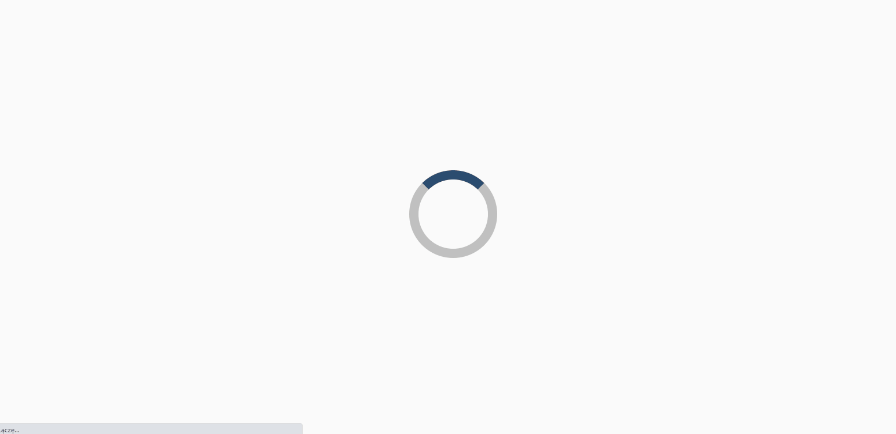
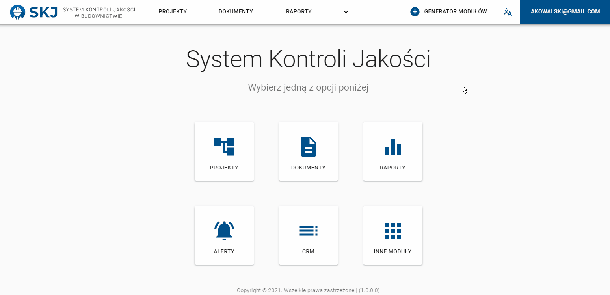
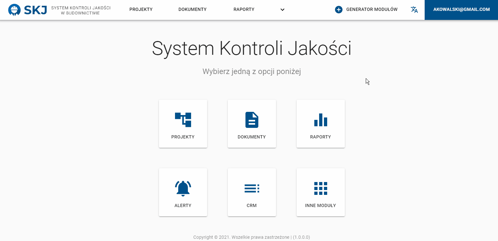
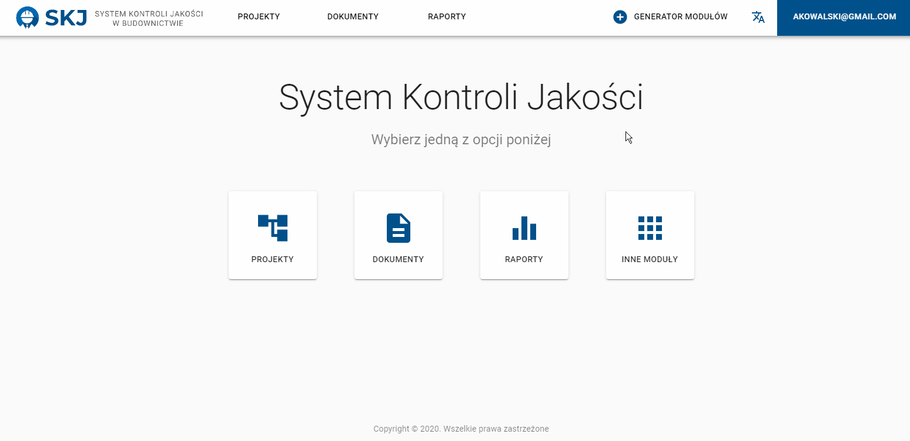
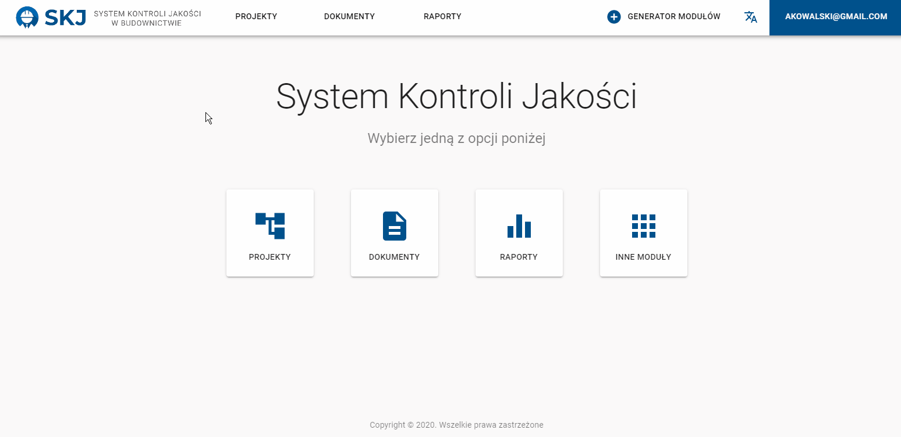
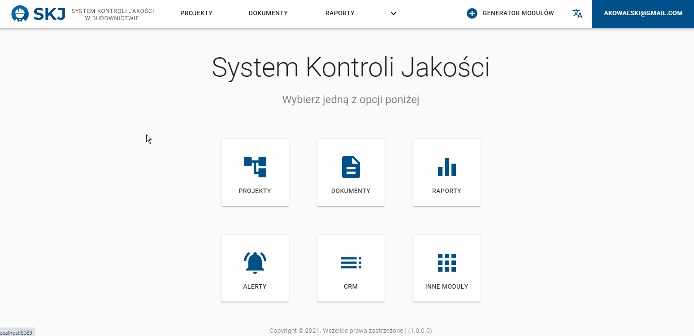
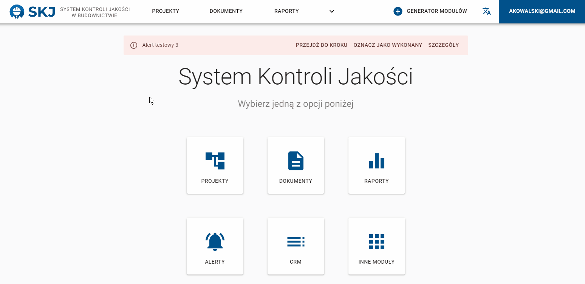

 

# 
👷‍♂️ Quality control system in construction industry

Commercial project implemented in React

 

## Table of Contents

- [What's this project about?](#ab)
- [Technologies used](#tech)
- [What I learned?](#what)
- [Features](#feat)

 

## What's this project about?

The website is an extensive application that helps to manage projects in construction. Supports adding, editing and designing projects, schedules, schedule steps and managing human resources (employees, users). It is possible to create document templates and add them to the schedule steps. It allows track the progress of work on a given project (also thanks to Gantt charts created on the fly). There is also a separate functionality for creating modules that allow you to completely rebuild the entire application. By default it supports the Polish language, but the English version of the website is also implemented. Alerts are automatically displayed if a given schedule or step is delayed. The "Reports" module allows generate analyzes of exceedances or advancement of project data. Simple CRM has also been implemented.

 

## Technologies used
- React
- React Router
- Enzyme
- Material-UI
- Redux
- Axios
- Thunk
- i18next

 

## What I learned?

- style components with Material UI in a more advanced way,
- create Gantt charts (npm package [React Google Charts](https://react-google-charts.com/)),
- create notifications for the entire application and handle them depending on the quantity,
- handle users login with tokens,
- create different language versions of the website,
- securing access to the website resources without logging in,
- cooperate with a team of programmers (including external backend developers),
- work with user sessions,
- creating advanced form validation,

 

## Features

- language versions of the website

  

 

- speed dial menu

  

 

- dropdown menu and profile edit page

  

 

- generating modules for a new application

  

 

- adding a new project

  

 

- importing schedules and steps into the project

  

 

- generating a Gantt chart

  

 

- editing a project, schedule, step, etc.

  

 

- reordering steps and nesting levels

  

 

- adding document templates and their fields

  

 

- adding steps and their documents (with fields)

  

 

- forms validation

  

 

- user session expiration

  

 

- list of alerts

  

 

- alert on main page and marking as done

  

 

- edit alert

  

 
